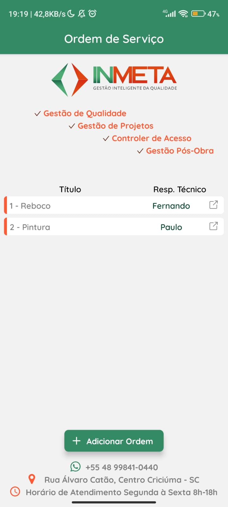
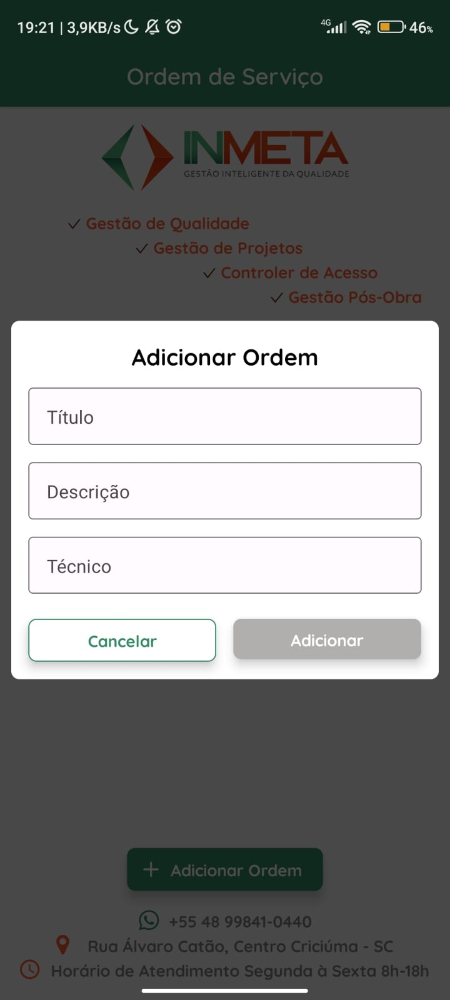
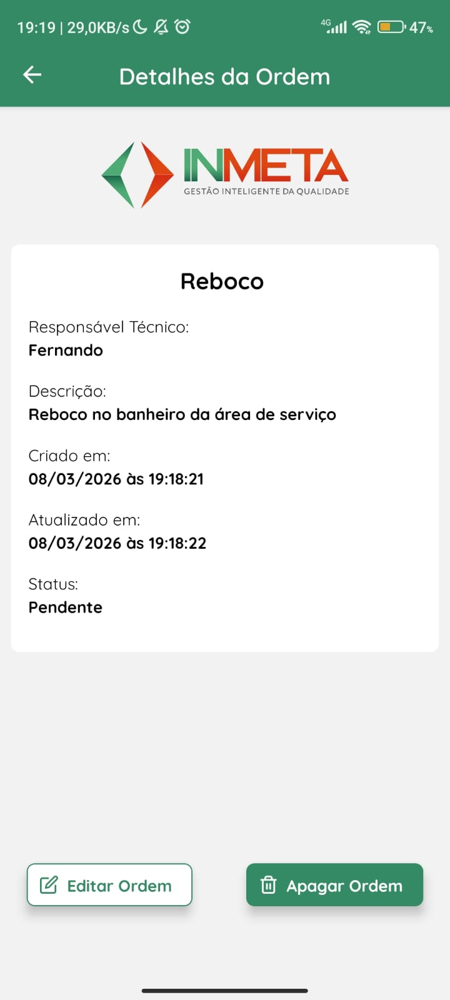
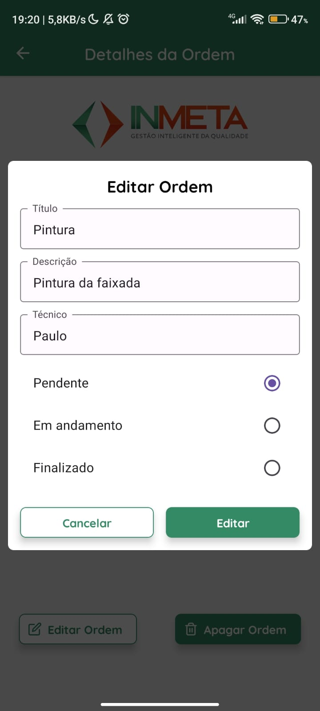
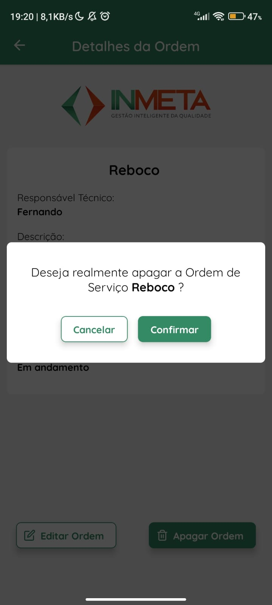

# Work Orders App

Este projeto foi desenvolvido como **teste técnico para a IN META Tecnologia**, com foco em mobile offline-first utilizando React Native.

O objetivo foi demonstrar habilidades em:

- Desenvolvimento mobile com **React Native**
- Gerenciamento de estado com **Zustand**
- Banco local **Realm**
- Boas práticas de layout e UX

---

## Screenshots

  


## Pré-requisitos

Antes de executar o projeto, você precisa ter instalado:

- Node.js (>= 18)
- npm ou yarn
- Android Studio (para rodar no Android)
- JDK 17
- React Native CLI

---

## Instalação

Clone o repositório:

```bash
git clone https://github.com/Emerson2342/teste-inmeta
```

Acesse a pasta:

```bash
cd teste-inmeta
```

Instale as dependências:

```bash
npm install
```

## Executando o projeto

Opção 1 - Rode diretamente na pasta raiz

```bash
npx expo run:android
```

Opção 2 - Caso deseje gerar o APK manualmente, primeiro gere os arquivos nativos:

```bash
npx expo prebuild
```

Dentro da pasta 'android' execute

Linux / Mac:

```bash
./gradlew assembleDebug
```

Windows:

```bash
gradlew.bat assembleDebug
```

o apk de build estará em

```bash
"android/app/build/outputs/apk/debug"
```
